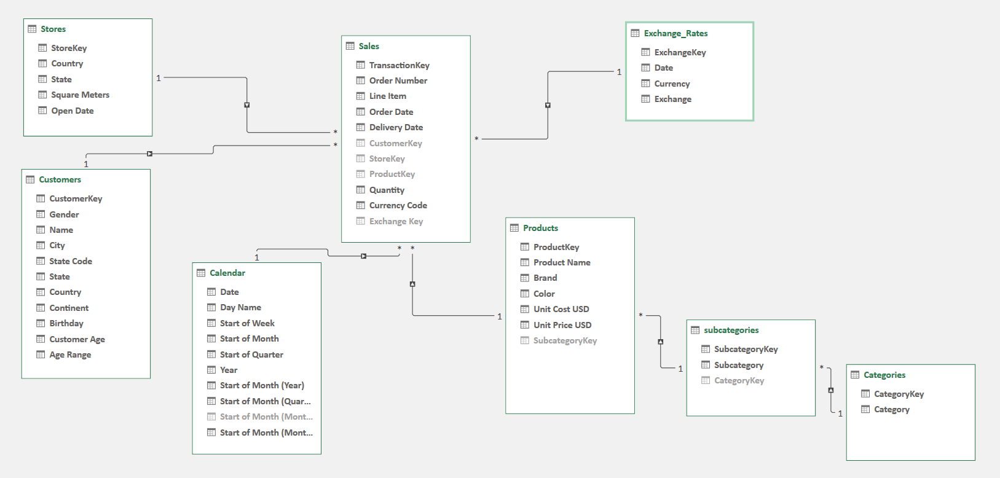
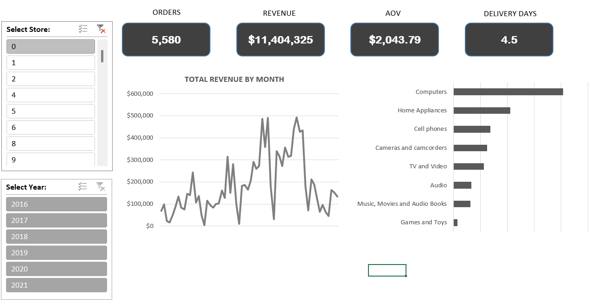

## 🧾 Maven Electronics Revenue Analysis (Excel Data Model & Dashboard)

### 📊 Overview

**Maven Electronics** is a global retailer of computers, phones, TVs, cameras, and appliances.
As a Data Analyst, I built an **Excel-based data model and interactive dashboard** to help management analyze **declining revenues since 2020** and explore performance across stores, products, and time.

🔹 **Goal:** Consolidate multiple raw CSVs → build relational data model → analyze trends → deliver insights through an interactive report.

🔹 **Tool:** Excel (Power Query, Power Pivot, DAX, PivotCharts)

---

### 🚀 Key Objectives & Deliverables

| Objective                       | Description                                                                                                                                          | Deliverable                     |
| ------------------------------- | ---------------------------------------------------------------------------------------------------------------------------------------------------- | ------------------------------- |
| **1. Profile & Prepare Data**   | Cleaned CSVs, handled missing values, standardized data types, created Calendar table, added derived fields (Age, Age Range, Delivery Days).         | Power Query transformations     |
| **2. Build Data Model**         | Connected Sales to Customers, Products, Stores, Calendar, and Exchange Rates via 1:* relationships. Split Products into Category/Subcategory tables. | Star schema model               |
| **3. Enrich & Explore**         | Created DAX measures (Revenue, Orders, AOV, Delivery Time) to analyze key KPIs and performance trends.                                               | Measures table & Pivot analysis |
| **4. Build Interactive Report** | Designed KPI cards, charts, and slicers for Store & Year. Focused on readability and consistency.                                                    | Excel dashboard                 |

---

### 💡 Data Model (Star Schema)

**Fact Table:** Sales

**Dimension Tables:** Customers, Products, Categories, Stores, Calendar, Exchange Rates

---

### 📈 Dashboard Overview

**Features:**

* KPI Cards → Orders, Revenue (USD), AOV, Avg Delivery Days
* Trend Line → Revenue by Month
* Bar Chart → Revenue by Product Category
* Slicers → Year, Store

**Design Focus:**

* Consistent theme & color palette
* Clean layout with minimal clutter
* Interactive, filter-connected visuals

---

### 📊 Insights & Findings

* **Revenue peaked in 2019**, then dropped sharply in **April 2020**, never fully recovering.
* Clear **seasonality** — revenue dips every April each year.
* **Online Store** contributes ~20% of total revenue.
* **Delivery performance improved** from 7.3 → 3.8 days (2016–2021).
* **Computers** & **Home Appliances** drive majority of sales.

---

### 🔍 Recommendations

* Investigate recurring April dips — potential supply chain or seasonal demand issue.
* Incorporate **Profit & Cost** data to evaluate margins.
* Add **Geo-level analysis** (stores by region/country).
* Extend to **Customer segmentation & cohort analysis** for loyalty insights.

---
